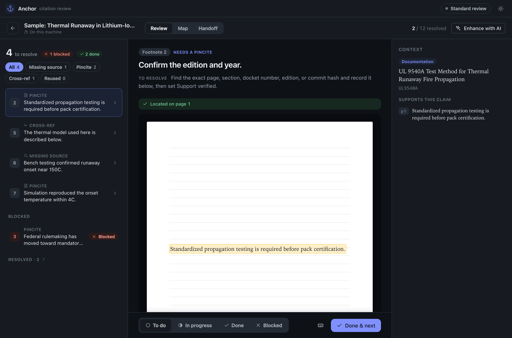
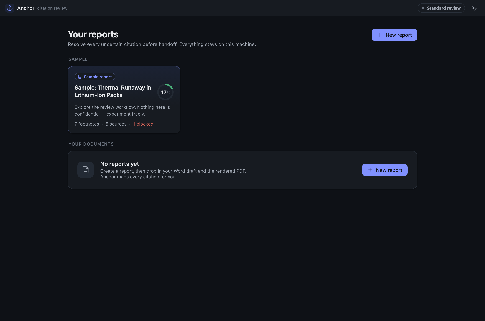
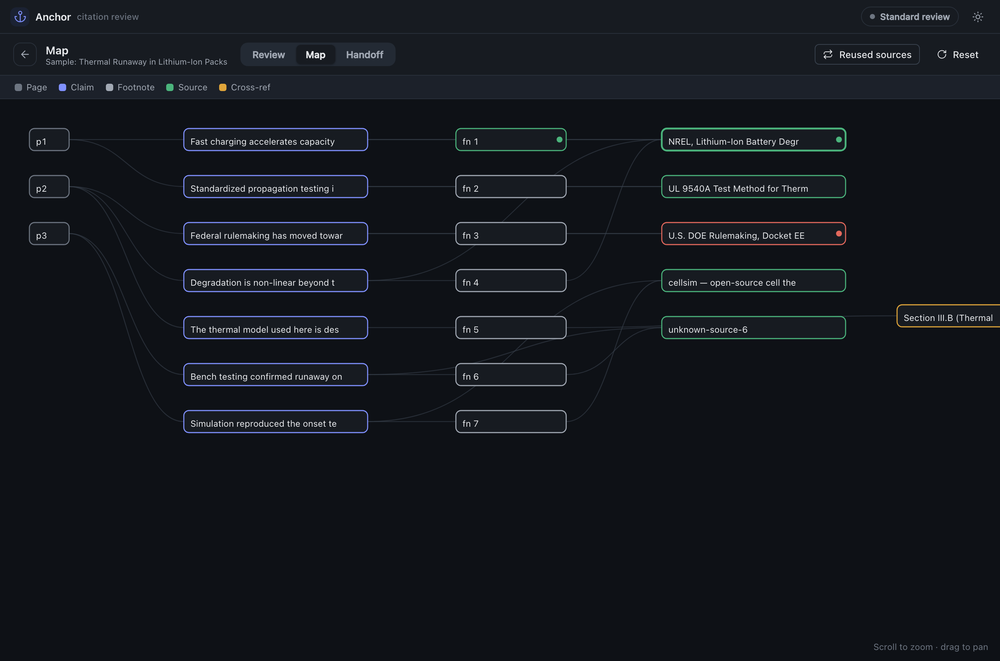

# Anchor

**A local, private desktop workbench for reviewing the citations in an expert report.**

Anchor takes your Word draft and the rendered PDF, reconstructs the chain

> **PDF page → claim → footnote → source → possible internal cross-reference**

and walks you through resolving every uncertain citation before handoff. It doesn't decide
whether a citation is final — it makes citation *uncertainty* visible, trackable, and
reviewable, so nothing slips through.

Everything runs on your machine. Your documents never leave it.



---

## Why it exists

Expert reports live and die by their citations: the right source, the right pincite, the
right internal cross-reference, the support actually checked. Finding what's still uncertain
across a 130-footnote report by hand is slow and easy to get wrong. Anchor maps the whole
report and turns the review into a calm queue you clear to zero.

- **A queue, not a pile.** Anchor groups what needs attention — missing sources, weak
  pincites, unconfirmed cross-references, reused sources, unverified support — and gives you
  one focused item at a time.
- **See it on the page.** Each claim is shown on its actual PDF page with the passage
  highlighted, and it's honest about confidence: *located*, *approximately here*, or
  *couldn't pinpoint* — a fuzzy match is never dressed up as a certainty.
- **Resolve once, clear many.** A source cited in five places is resolved once; every
  citation that uses it updates together.
- **Handoff that's actually useful.** Export a readable report — blocked items first, every
  finding kept, keyed to page and footnote — for the next reviewer.

| Your reports | The relationship map |
|---|---|
|  |  |

---

## Privacy

- Anchor makes **no network calls of its own** and runs **no server**. There is nothing to
  upload to.
- Your documents, page images, and review notes stay in a folder on your machine.
- **The one exception is the optional AI step.** If you turn it on, portions of the
  document's text are sent to Anthropic or OpenAI *through your own CLI agent* so it can make
  suggestions. Anchor tells you this at the moment you enable it, per document, and marks
  which documents had AI used. Don't use AI on material you can't share with that provider.

## AI is optional — and works with a *subscription*

Anchor is fully usable with **no AI at all** — that's **Standard review**, the default, and
it does the whole job: mapping, the queue, the highlighted pages, the handoff.

If you want AI suggestions on top, Anchor drives the **local command-line agents** that your
existing subscription already authorizes — no separate API key, no per-token cost:

- **Claude Pro / Max** → Claude Code (`claude`)
- **ChatGPT Plus / Pro** → Codex (`codex`)

A one-time setup installs the tool and signs you in. After that, Anchor uses it locally.
Every AI value is shown as a **labeled suggestion** — never as a decision. You confirm it.

---

## Install

### The app
Download the latest `Anchor.dmg` (macOS) or `Anchor.exe` (Windows) from
[Releases](https://github.com/tuckerpeters/anchor/releases), or build it yourself (below).
On first launch you'll land on a **sample report** you can explore immediately — no setup,
no upload.

### AI setup (optional, one time)
If you want AI suggestions, run the installer for your platform. It installs everything a
never-coded-before user needs and walks you through signing in:

- **macOS:** double-click `installers/install-anchor.command`
- **Windows:** right-click `installers/install-anchor.ps1` → *Run with PowerShell*
  *(experimental — written carefully but not yet tested on a real Windows machine)*

Then, in Anchor, open the AI chip (top right) → **Test connection**.

---

## How you use it

1. **New report** → drop in your Word draft and the rendered PDF (a Markdown source register
   is optional).
2. Anchor **maps** the citations and locates each claim on its page.
3. **Work the queue** to zero: read what's uncertain, check the page, record what you found,
   set a status. Optionally run an **AI pass** for suggestions.
4. **Handoff:** export a clean report for the next reviewer.

Statuses are deliberately simple — **To do · In progress · Done · Blocked** — with optional
in-progress sub-steps (source found · support verified · draft written). Nothing you do is
destructive: every change is a single **Undo**.

---

## Build from source

Requires Node 20+.

```bash
git clone https://github.com/tuckerpeters/anchor
cd anchor
npm install
npm run dev      # run the app in development
npm test         # unit tests
npm run e2e      # end-to-end tests
npm run web      # browser-only UI preview (uses a mock backend; for design work)
npm run package  # build a distributable (.dmg / .exe)
```

**Stack:** Electron · Svelte 5 · Vite · Node. PDF text + layout via `pdf.js` (no native
canvas dependency); DOCX footnotes parsed in pure JS; a deterministic graph baseline with an
optional AI overlay driven by the local CLI agents. Plain JSON on disk, no database.

**Platform status:** built and tested on macOS. Windows packaging and installer are included
but not yet verified on a real Windows machine — reports and PRs welcome.

---

## License & authorship

Copyright © 2026 **Tucker Peters**. Licensed under the [Apache License 2.0](LICENSE).

Anchor is the independent personal work of Tucker Peters, authored in the author's own time
and with the author's own resources (see [NOTICE](NOTICE)). It is not a work made for hire
and is not affiliated with, endorsed by, or the property of any employer or third party. The
open-source license grants you broad rights to use and build on the code; it does not
transfer ownership.

🤖 Built with [Claude Code](https://claude.com/claude-code).
